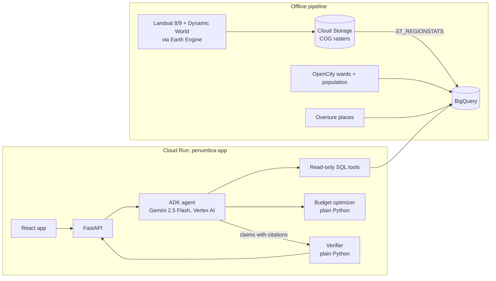

# Groundtruth

Ward-level heat decisions for Bengaluru's city engineers, with every
figure checked against the data before it is shown.

| | |
|---|---|
| Live app | https://penumbra-app-891315005311.us-central1.run.app |
| Demo video (3 min) | *add link before submission* |
| Slide deck (PDF) | *add link before submission* |
| Team | *add names before submission* |

Built for the Google Cloud AI Builder Cup 2026, theme Sustainability &
Social Impact.

## The problem

Since September 2025 Bengaluru has been governed as five corporations with
369 wards, so the ward is the unit where cooling work gets funded. Satellite
data on surface heat and green cover exists, but turning it into "which
ward first, with what, for how much" normally takes GIS specialists and
weeks. And a planner cannot defend a decision on a number a chatbot made up.

## What Groundtruth does

- **Ranks all 369 wards by heat risk** from 2025 satellite data: surface
  temperature, green cover, built-up share and population density, with
  adjustable weights. Also shows change since 2016.
- **Answers planning questions in plain language**, for example "Which five
  wards in the East corporation warmed most since the baseline year?", and
  shows how the answer was made, step by step.
- **Verifies every figure.** Each number and ward name in an answer cites
  the stored result of a data query. Code, not the language model, checks
  it; anything that fails is removed. The answer footer says "N of N
  figures verified", and every figure opens its source.
- **Plans a cooling budget** across wards and interventions, and compares
  it with funding the hottest wards first.
- **Exports a ward brief** for a meeting, in English with Kannada ward names
  and section labels, printable as PDF.

## Results (all from real runs; details in [docs/RESULTS.md](docs/RESULTS.md))

**Ablation, 18 planning questions, same Gemini model**
(`eval/run_eval.py`, run 2026-09-25; expected answers computed from
BigQuery or the optimizer at run time):

| | Gemini alone | Agents, no verification | Full Groundtruth |
|---|---|---|---|
| Answers fully correct | 0 of 18 | 16 of 18 | 16 of 18 |
| Answers with unsupported figures | 10 of 18 | 0 of 18 | 0 of 18 |
| Median time | 10.3 s | 14.4 s | 14.4 s |
| Mean cost per question | $0.0028 | $0.0031 | $0.0031 |

Both agent misses were failures to answer (one 45-second timeout, one run
where the model returned no structured answer), not wrong answers. The
verifier traced 79 of 80 cited figures and ward names. On this question set it did
not change the number of correct answers; what it adds is the guarantee
that every figure shown traces to a data result. In a smoke run it caught
the agent inventing a surface temperature (31.7 °C where the data says
40.52 °C) and removed it.

**Budget decision** (East corporation, Rs 50 crore, assumed costs): the
optimized plan models 30% more cooling (368,966 vs 283,697 person-°C) and
reaches wards home to 121% more people (555,430 vs 251,425) than funding
the hottest wards first, with the same catalog and budget.

**Ranking checks** (run 2026-09-24): all 369 wards scored with no missing
values. Under a ±0.1 change to any weight, the ranking's Spearman
correlation with the default stays at 0.989 or above. Several of the
coolest wards sit on known lakes and parks (Agaram Lake, Sankey Tank,
Cubbon Park); several of the hottest are dense, low-vegetation areas in
the historic core. This check is qualitative, not a GIS overlay.

**Cooling model** (`model/cooling_model.py`): ridge regression on 59,828
grid points with spatial block cross-validation. Held-out R² 0.26, RMSE
2.03 °C: a weak to moderate fit, and the product says so. +0.1 NDVI is
associated with -1.15 °C surface temperature (90% range -1.18 to -1.13).

## How it works



1. The pipeline builds pre-monsoon (March to May) median composites for
   2016 and 2025 from Landsat 8/9 Collection 2 Level 2 and Dynamic World,
   exports them as Cloud Optimized GeoTIFFs, and summarizes them per ward
   with BigQuery's `ST_REGIONSTATS`.
2. A question goes to one ADK agent on Gemini 2.5 Flash. It can only call
   read-only, parameterized SQL tools over allow-listed metrics, plus the
   budget optimizer. Every call gets a `tool_result_id` and is logged.
3. The agent writes its answer with a placeholder for every figure and a
   claim citing the result and path it came from. The verifier resolves
   each one, compares values and units, and removes what fails, along with
   any number written outside a placeholder.

More in [docs/architecture.md](docs/architecture.md). Every deviation from
the original plan is recorded in [docs/DECISIONS.md](docs/DECISIONS.md).

## Data sources and licenses

| Data | Source | License |
|---|---|---|
| Ward boundaries and population | OpenCity, GBA final ward map with population, Dec 2025 (population is 2011 Census apportioned to 2025 wards) | Listed as "Other (Public Domain)" on OpenCity |
| Surface temperature, NDVI | USGS Landsat 8 and 9, Collection 2 Level 2, via Google Earth Engine | Public domain, courtesy of the U.S. Geological Survey |
| Built-up share, water | Google Dynamic World V1 | CC BY 4.0 (Google, with National Geographic Society and World Resources Institute) |
| Elevation (cooling model only) | NASA SRTM 30 m | NASA/JPL public use terms |
| Hospitals and schools | Overture Maps places, BigQuery public data | CDLA Permissive 2.0 and Apache 2.0, by source |
| Intervention guidance | WRI India (2022) Bengaluru climate action proceedings; US EPA (2014) heat island compendium | Cited by page in the app |

## Tech stack

Gemini 2.5 Flash on Vertex AI; Google Agent Development Kit (`google-adk`);
BigQuery with `ST_REGIONSTATS`; Earth Engine; Cloud Storage; Cloud Run.
FastAPI (Python 3.11). React 19, TypeScript, Vite, MapLibre GL JS, React
Router, TanStack Query, CSS Modules. pytest and Vitest.

## Run it

You need a Google Cloud project with billing, BigQuery, Cloud Run, Vertex
AI, Cloud Storage and Earth Engine enabled; `gcloud`, `bq`, Python 3.11+
and Node 22. There is no API key: the app uses Application Default
Credentials locally and a service account on Cloud Run.

```bash
gcloud auth application-default login
python3.11 -m venv .venv && source .venv/bin/activate
pip install -r pipeline/requirements.txt -r server/requirements-dev.txt
```

**Build the data layer** (once; the dataset and bucket must be in the US
region for Earth Engine rasters). Each script's header states its inputs.

```bash
bq query --use_legacy_sql=false < pipeline/01_prepare_wards.sql
python pipeline/02_export_composites.py      # starts Earth Engine exports to Cloud Storage
bq query --use_legacy_sql=false < pipeline/03_zonal_stats.sql
python pipeline/04_population.py
bq query --use_legacy_sql=false < pipeline/05_infrastructure.sql
bq query --use_legacy_sql=false < pipeline/06_risk.sql
python pipeline/07_grid_sample.py && python model/cooling_model.py
python pipeline/08_export_geojson.py
python pipeline/09_intervention_catalog.py
python pipeline/10_export_results.py
```

**Run locally**

```bash
export GOOGLE_GENAI_USE_ENTERPRISE=1 GOOGLE_CLOUD_PROJECT=<project> \
  GOOGLE_CLOUD_LOCATION=us-central1 MODEL_ID=gemini-2.5-flash BQ_DATASET=penumbra
uvicorn server.main:app --port 8080       # API
cd web && npm ci && npm run dev           # app on :5173, proxies /api
```

**Test and evaluate**

```bash
python -m pytest server/tests eval
cd web && npm test
python eval/run_eval.py                   # about 10 minutes, a few US cents
python scripts/smoke.py <deployed URL>    # checks a live deployment
```

**Deploy**

```bash
gcloud run deploy penumbra-app --source . --region us-central1 \
  --service-account <service account> --allow-unauthenticated \
  --set-env-vars GOOGLE_CLOUD_PROJECT=<project>,GOOGLE_CLOUD_LOCATION=us-central1,BQ_DATASET=penumbra,MODEL_ID=gemini-2.5-flash,GOOGLE_GENAI_USE_ENTERPRISE=1
```

## Repository layout

```
pipeline/   data layer: Earth Engine exports, zonal stats, risk scores, exports
model/      cooling-effect model (fit, spatial CV, bootstrap)
cities/     city pack: intervention catalog and guidance citations
server/     FastAPI, ADK agent, tools, verifier, optimizer, tests
web/        React app
eval/       question set, ablation runner, raw results
scripts/    deployment smoke test
docs/       architecture, decisions, running notes, results
```

## Limitations

- Land surface temperature is not air temperature, and Landsat passes in
  the morning, not at peak afternoon heat.
- Each year is one pre-monsoon season. The city's mean surface temperature
  was higher in the 2016 composite than in 2025, so "change since 2016"
  mixes weather with lasting change.
- Population is 2011 Census data apportioned to the 2025 wards.
- Cooling effects are modeled associations from a weak to moderate model,
  not guaranteed outcomes. Cool roofs and permeable paving have no modeled
  effect here.
- Every intervention cost is an assumption until replaced with real quotes.
- The ranking check against known places is qualitative.
- About 1 in 9 questions fails to answer (a 45-second timeout or no
  structured answer; 2 of 18 in the reported run, on different questions
  each run).
- Groundtruth makes no claims about individual streets, buildings or
  addresses.

## Responsible use

Groundtruth is decision support for planners, not an automated decision.
It uses only public, open datasets and no personal data. Sources,
assumptions and limits are shown in the app.
