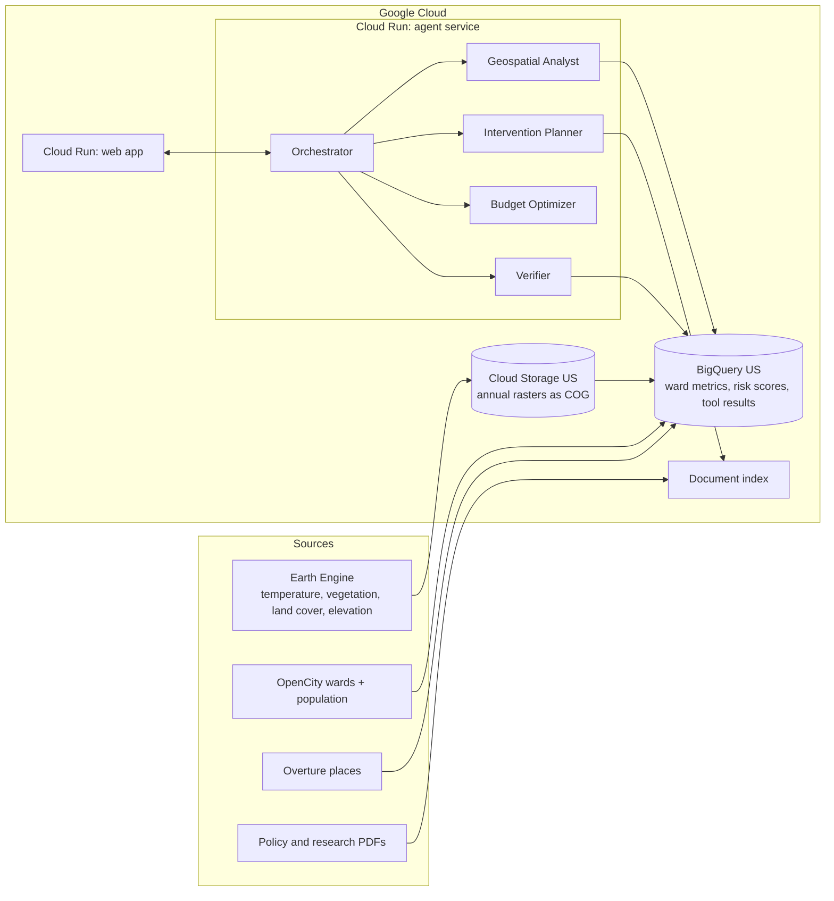

# Penumbra

**Agentic Platform for Urban Climate Resilience (APUCR)**

*Ward-level heat decisions for city planners, with every number checked against the data.*

> **Status:** work in progress, built for the Google Cloud AI Builder Cup 2026 (theme: Sustainability & Social Impact).
> Sections marked **TODO** are filled in as the build progresses. Do not treat any number in this README as a result until it is filled in from a real run.

| | |
|---|---|
| Live demo | TODO: Cloud Run URL |
| Demo video (3 min) | TODO: link |
| Slide deck | TODO: link to PDF |
| Team | TODO: names |

---

## The problem

Cities like Bengaluru have lost much of the vegetation and open water that once kept them cooler and let rain soak into the ground. Since September 2025 the city has been run as five corporations with **369 wards**, so the ward is now the natural unit for decisions.

Satellite data on heat and land cover exists, but a planner deciding **which ward to act on first, with what intervention, and at what cost** usually needs GIS specialists and weeks of analysis. Decisions end up resting on partial information.

*TODO: add one or two cited statistics from published studies (cite the papers directly).*

## What Penumbra does

Penumbra is a decision tool, not a dashboard and not a chatbot.

- **Ranks all 369 wards** by heat risk, combining surface temperature, green cover, built-up pressure and population exposure. Weights are adjustable.
- **Answers planning questions in plain language**, such as "Which five wards in the East corporation have warmed most since 2015 and have the least green cover?"
- **Recommends interventions within a budget**, using a budget optimizer and modeled effect ranges fitted to local data.
- **Verifies every figure.** Each number in an answer points to the query result it came from, and a Verifier agent re-checks it before it reaches the screen.
- **Produces a ward brief** a corporation engineer can take into a meeting: risk summary, key figures, recommended actions, assumptions and limits.

## How it works



### The agents

| Component | Job |
|---|---|
| **Orchestrator** | Plans the steps for a question, delegates, and assembles the answer as structured claims. |
| **Geospatial Analyst** | Calls vetted, read-only data tools (rank wards, compare years, list wards by corporation). |
| **Intervention Planner** | Retrieves cited guidance and modeled effect ranges for a ward. |
| **Budget Optimizer** | Allocates a budget across wards and interventions. Plain Python, no language model. |
| **Verifier** | Re-reads each cited tool result and compares values and units. Failed figures are removed or marked as assumptions. |

### Why numbers can be trusted

1. The language model plans and explains. It does not compute numbers.
2. Every tool result is stored with an ID.
3. The final answer is structured claims, each citing a result ID.
4. The Verifier checks each claim against the stored result, and the UI shows how many figures were verified.

## Data

| Layer | Source | Status |
|---|---|---|
| Ward polygons and population | OpenCity, GBA 369-ward map | TODO: confirm license and file format |
| Surface temperature | Landsat Collection 2 Level 2 via Earth Engine | TODO: confirm asset IDs and scale factors |
| Vegetation, built-up, elevation | Earth Engine catalog (Sentinel-2 / Dynamic World / DEM) | TODO: choose and document datasets |
| Hospitals and schools | Overture Maps (BigQuery public data) | TODO: confirm categories and license |
| Guidance documents | Climate action and resilience plans, published studies | TODO: list documents |

Ward metrics come from annual summer composites exported as Cloud Optimized GeoTIFFs and summarized per ward with BigQuery's `ST_REGIONSTATS`. Earth Engine data only works with queries run in the US region, so the BigQuery dataset and Cloud Storage bucket are in the US.

## Tech stack

- **AI:** Gemini models through the Google Cloud agent platform, with the Agent Development Kit (ADK) for the agents
- **Data:** BigQuery (including `ST_REGIONSTATS`), Earth Engine, Cloud Storage
- **Hosting:** Cloud Run (agent service and web app)
- **Retrieval:** a document index with page-level citations
- **App:** Python backend, web frontend with an interactive map
- TODO: pin exact versions once chosen

## Getting started

> Commands are a starting point. Check them against the current Google Cloud documentation before running.

**Prerequisites**

- A Google Cloud project with billing enabled
- Earth Engine access registered for the project
- `gcloud` CLI and Python 3.11 or newer

**1. Set up the project**

```bash
git clone https://github.com/TODO/penumbra.git
cd penumbra
gcloud config set project YOUR_PROJECT_ID
gcloud services enable bigquery.googleapis.com run.googleapis.com \
  storage.googleapis.com earthengine.googleapis.com
# TODO: add the Gemini / agent platform API once confirmed
```

**2. Create US-region storage**

```bash
bq --location=US mk -d YOUR_PROJECT_ID:penumbra
gcloud storage buckets create gs://YOUR_BUCKET --location=US
```

**3. Build the data layer**

```bash
# TODO: scripts to build and export composites, load wards, and run region stats
python pipeline/export_composites.py --city bengaluru --years 2015 2020 2025
python pipeline/load_wards.py --city bengaluru
python pipeline/compute_ward_metrics.py --city bengaluru
```

**4. Run locally**

```bash
# TODO: local run instructions for the agent service and web app
```

**5. Deploy**

```bash
# TODO: gcloud run deploy commands
```

## Repository layout (planned)

```
penumbra/
├── pipeline/        # Earth Engine exports, ward loading, region stats
├── agents/          # ADK agents and tool definitions
├── optimizer/       # budget allocation logic
├── model/           # cooling-effect model and validation
├── eval/            # evaluation questions and scoring scripts
├── web/             # map and chat frontend
├── cities/          # city packs (config per city)
└── docs/            # architecture notes and decisions
```

## Evaluation

We test the system on a set of planner questions whose correct answers come from hand-written SQL, run separately from the agents. Results are reported honestly, including failures.

| Setup | Answer accuracy | Unsupported figures |
|---|---|---|
| Model only, no tools | TODO | TODO |
| Agents without the Verifier | TODO | TODO |
| Full Penumbra | TODO | TODO |

Validation of the ward ranking against independent evidence (known hotspots and lakes, weight-sensitivity checks): **TODO**.

## Limitations

- Land surface temperature is not air temperature or felt heat.
- Landsat passes over in the morning, not at peak afternoon heat.
- Clouds leave gaps, especially in the monsoon. The data layer reports the share of valid pixels per ward.
- Ward boundaries changed in 2025. Historical trends use pixel data summarized over the current wards.
- Cooling estimates come from a statistical model of local data. They are associations, not guaranteed outcomes.
- Default intervention costs are editable assumptions unless a source is cited.
- The tool supports decisions at ward level. It makes no claims about individual streets or properties.

## Responsible use

- Recommendations are decision support for planners. They are not automated actions.
- Only public, open datasets are used, and no personal data.
- Sources, assumptions and limits are shown in the app.

## Roadmap

- **City packs:** each city is a configuration bundle (boundaries, population source, clear-sky window, currency and unit costs, languages, guidance documents, optional validation set). Bengaluru is the calibrated, validated flagship; other cities run in a labeled screening mode.
- Flood-stress layer using elevation, built-up cover, lake loss and proximity to drains.
- Kannada ward briefs.
- A second city, with onboarding time measured and reported.

## Acknowledgements

Built for the Google Cloud AI Builder Cup 2026, organized by Hack2skill with Google Cloud. Ward boundaries and population data from OpenCity. Satellite imagery from the Landsat program through Google Earth Engine.

## License

TODO: choose a license (for example MIT or Apache-2.0) and add a `LICENSE` file. Check the competition's Terms & Conditions for any IP requirements first.

<!-- Keep the next line only if it is true when you submit. -->
All code in this repository was written during the hackathon period.
